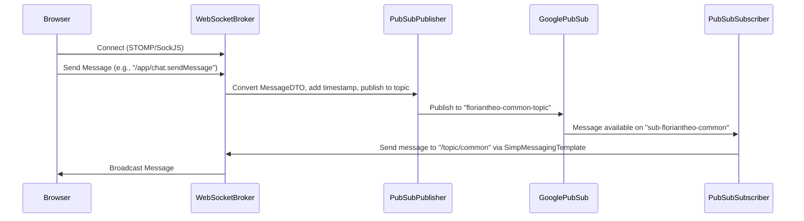

# Project Documentation: ChatRouter

**Overview:**

ChatRouter is a real-time chat application built using Spring Boot, Spring Cloud GCP Pub/Sub, and WebSocket technology (STOMP + SockJS). It allows users to exchange messages through a web interface, with the backend handling message routing and persistence via Google Pub/Sub. The application utilizes WebSocket for real-time communication between clients and the server, and Pub/Sub for asynchronous message handling and distribution.

**📦 Architecture:**

The application follows a microservice architecture, with the following key components:

- **Front-end:** Implemented using Thymeleaf, WebJars (Bootstrap, jQuery, SockJS, STOMP) and a single page (`index.html`) that connects to the WebSocket broker.
- **Back-end:**
  - **ChatController:** Handles WebSocket messages, adds timestamps, publishes messages to Pub/Sub, and broadcasts messages to relevant topics.
  - **PubSubSubscriptionService:** Manually retrieves messages from Pub/Sub subscriptions using `PubSubInboundChannelAdapter` and forwards them to WebSocket topics using `SimpMessagingTemplate`.
- **Pub/Sub:** Uses Google Pub/Sub for message queuing and asynchronous communication.
  - **Topics:**
    - `floriantheo-common-topic`
    - `floriantheo-user-topic`
  - **Subscriptions:**
    - `sub-floriantheo-common`
    - `sub-floriantheo-user`



**Key Components:**

- **ChatController.java:** Handles incoming WebSocket messages, publishes them to the Pub/Sub topic, and sends them back to the WebSocket topic.
- **PubSubSubscriptionService.java:** Contains the logic for subscribing to Pub/Sub topics and forwarding messages to the appropriate WebSocket topics. It uses PubSubInboundChannelAdapter to retrieve messages manually from subscriptions and SimpMessagingTemplate to send these messages to WebSocket topics.
- **MessageDTO.java:** A record that represents the message format used throughout the application.
- **WebSocketConfig.java:** Configures the WebSocket message broker and STOMP endpoints.
- **PubSubConfig.java:** Configures the JacksonPubSubMessageConverter for message conversion.
- **application.yml:** Contains the application's configuration, including GCP project ID, Pub/Sub emulator settings, and server port.

**Topics and Subscriptions:**

- **Topics:**
  - `floriantheo-common-topic`: Used for general chat messages.
  - `floriantheo-user-topic`: Used for user-specific messages.
- **Subscriptions:**
  - `sub-floriantheo-common`: Subscription for the floriantheo-common-topic.
  - `sub-floriantheo-user`: Subscription for the floriantheo-user-topic.

**Front-end details:**

The `index.html` file serves as the main entry point for the chat application. It uses JavaScript (`main.js`) to handle WebSocket connections, send messages, and display received messages.
The `main.js` file uses the SockJS and STOMP libraries to establish a WebSocket connection with the server.

**How messages are sent:**

The user enters a message in the input field and submits the form.
The `sendMessage()` function in `main.js` is called.
The `sendMessage()` function retrieves the message text and constructs a `MessageDTO` object.
The `sendMessage()` function uses the STOMP client to send the `MessageDTO` to the `/app/chat.sendMessage` endpoint on the server.
The `ChatController.sendMessage()` method in `ChatController.java` handles the message on the server.
The `sendMessage()` method adds a timestamp to the message if it is missing.
The `sendMessage()` method serializes the message to JSON using `objectMapper.writeValueAsString()`.
The `sendMessage()` method publishes the JSON string to the `floriantheo-common-topic` Pub/Sub topic using `pubSubTemplate.publish()`.
The `sendMessage()` method also returns the original `MessageDTO` object, which is then sent to the `/topic/common` WebSocket topic, and broadcast to all connected clients.

**🚀 Local Execution:**

To run the application locally, the following prerequisites are required:

- Java 17+
- Maven 3.8+
- GCP SDK (optional if using an emulator)
- Service account JSON with Pub/Sub permissions
- Pub/Sub emulator (if running locally)

Disable the Pub/Sub health check in `application.yml` to avoid issues when running locally:

```
management:
  health:
    pubsub:
      enabled: false
```

Open `http://localhost:8080/` in your browser.

**🚧 Potential Issues:**

The README mentions a potential issue with `JacksonPubSubMessageConverter` failing to deserialize `MessageDTO` if it's a record without a default constructor or `@JsonCreator` annotation. The `ChatController` serializes the `MessageDTO` to JSON before publishing to PubSub as a workaround.

**Improvements:**

Instead of publishing the JSON string, publish the `MessageDTO` object directly using `pubSubTemplate.publish(topic, chatMessage)`.
Ensure the `MessageDTO` has a default constructor or a `@JsonCreator` annotation to resolve the deserialization issue with `JacksonPubSubMessageConverter`.
Consider using Spring Cloud Stream for simplified Pub/Sub integration.
